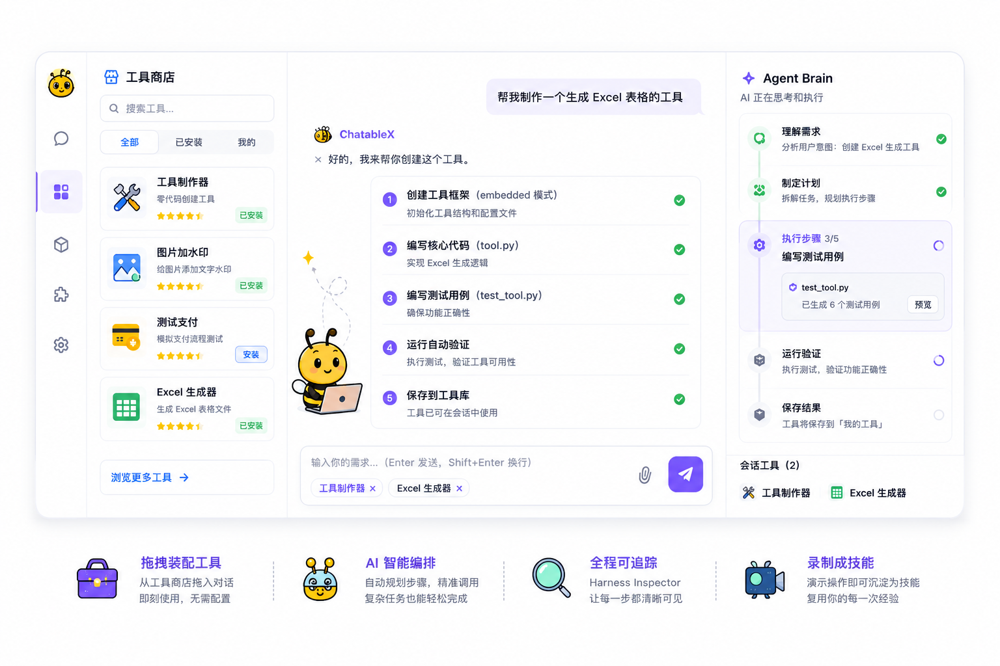
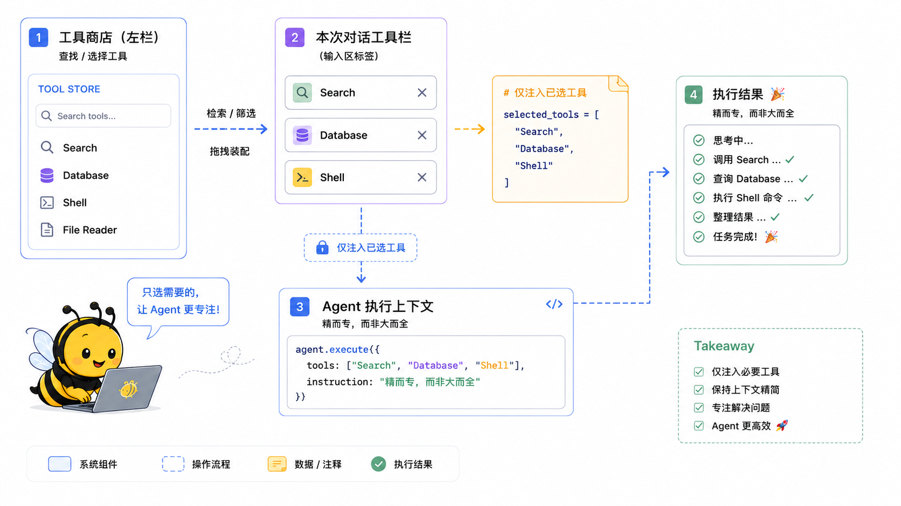

<p align="right">
  <strong>English</strong> | <a href="./README.zh-CN.md">中文</a>
</p>

<div align="center">


<h1>ChatableX · Agent Platform</h1>

<h3><em>Make Everything Conversational</em></h3>

<font color="#0969da" size="3">Agent Loop Native · Harness Native — Every tool call is traceable, recoverable, and correctable, so anyone can solve problems with engineer-grade precision.</font>

[]()
[]()
[]()

</div>

<p align="center">
  
</p>

## Product Positioning

**ChatableX is an Agent Loop Native desktop Agent platform** — powered by a Harness engineering stack that runs through the full Agent Loop execution cycle, ensuring every tool call is traceable, recoverable, and correctable.<br>
It lets everyday users wield Tools, Skills, and AI Apps with engineer-grade precision: turn recurring workflows into **stable, callable tools**, then let the Agent orchestrate them through conversation — instead of asking AI to rebuild everything from scratch each time. The entire process is visible, anomalies are detected and corrected automatically, and failures can be retried or resumed from any step.

## Design Philosophy

> **The premise of "conversation drives everything" is not letting AI do it all — it's letting AI precisely orchestrate stable tools.**

### Conversation-Driven, Not Code-Driven

The name **ChatableX** comes from **Chat + able + X** — **conversable**. Our belief: **make every application conversational; let conversation drive everything**.

Products like Codex and Cursor are code-centric — even with Vibe Coding trending, the underlying mindset is still "solve problems with Code." ChatableX takes the other path: **express intent in natural language without caring how the underlying code works**.

But conversation-driven interaction alone is not enough. Many agents accept natural language, yet if you hand an entire task to AI to generate from scratch, hallucination, instability, and non-reproducibility are almost inevitable. **ChatableX's answer: give determinism to tools, give uncertainty to Agent orchestration.**

### Stable Tools, Not From-Scratch Generation

Real work is never a pre-designed pipeline — it is **discrete, fragmented, and highly repetitive**.

A large task is essentially a composition of many small steps. ChatableX advocates **layered decomposition**: turn each step into an executable, verifiable, reusable **stable micro-tool**, then assemble them to complete complex work.

Take "add a watermark to an image" — a trivial but frequent operation. If AI writes fresh code every time, even the best model can produce wrong parameters or execution errors. The right approach: **use the best model once to build a verified, callable tool** — build once, reuse forever. Assemble micro-tools, and you reliably complete bigger tasks.

This is why ChatableX provides a **Tool Store** —

- **Only stably executing tools have lasting value** — they should not be discarded when a task ends
- Much of real work **repeats** — ChatableX helps you crystallize those recurring flows into micro-tools
- Tool creation can use the **strongest models** to get quality right (spend where it matters)
- Day-to-day orchestration can use **local quantized small models** to call those tools at minimal token cost

**Ideas are the product; language is the interface — but behind the interface must be verified, stable tools.**

### Deterministic Flows Must Become Tools

The industry often claims "AI can do anything," but in professional domains, AI cannot build everything from zero.

Building a game? You don't write a game engine from scratch — you build on **stable engines** like Unity or Unreal; an engine itself is a collection of many micro-tools. The same applies to e-commerce and ERP: order, inventory, and settlement flows are **fixed and validated through business abstraction** — traditionally carried by ER-driven business systems. AI should not rewrite them every time.

The right path: **turn deterministic business flows into fixed, callable tools and expose APIs to the Agent** — let AI handle understanding and orchestration, not reinvent business logic.

**This is the core meaning of using ChatableX:**

1. Turn your recurring, deterministic workflows into **stable, callable tools**
2. Hand those tools to ChatableX and let the Agent **orchestrate them through natural language**
3. The platform uses **Agent Loop** to keep the execution cycle coherent and controllable, and **Harness** to ensure every tool call is traceable, recoverable, and correctable — so your words **route accurately to the right tool**

### Layered Responsibilities: Tool Delivery, Agent Orchestration, Model Reasoning

ChatableX establishes a three-layer responsibility model — conversation drives everything only when each layer does its job:

<table>
<thead>
<tr>
<th align="left" nowrap>Layer</th>
<th align="left" nowrap>Owner</th>
<th align="left">Quality Bar</th>
</tr>
</thead>
<tbody>
<tr>
<td align="left" nowrap>Tool Delivery</td>
<td align="left" nowrap>Humans + Stable Tools</td>
<td align="left">APIs, scripts, and helper tools must be verified and tested</td>
</tr>
<tr>
<td align="left" nowrap>Agent Orchestration</td>
<td align="left" nowrap>AI Agent</td>
<td align="left">Parse user intent and route precisely to the right tool or MCP service</td>
</tr>
<tr>
<td align="left" nowrap>Model Reasoning</td>
<td align="left" nowrap>AI Model</td>
<td align="left">Handle ambiguous intent, plan steps, and explain results</td>
</tr>
</tbody>
</table>

Deterministic delivery is guaranteed by **stable tools**, intent understanding and orchestration by the **Agent**, and fuzzy reasoning and planning by the **model** — each layer has a clear role, and only then can "conversation drives everything" work in practice.

## Tool Misselection and Mitigation

Once tool count grows, **Agent orchestration accuracy** becomes the top challenge — Are tool calls correct? Is the execution chain traceable? Can anomalies be pinpointed?

Within a single business domain, different users may accumulate hundreds to thousands of custom tools.<br>
If all tools are preloaded into Agent context, or batch-injected via RAG retrieval, tool misselection, parameter hallucination, and runaway call chains become systemic risks.<br>
ChatableX uses **Session-scoped Tool Isolation** — users declare the tool set for each session at the conversation level, rather than letting the agent preload full capabilities upfront:

<p align="center">
  
</p>

### Design Principles

1. **Intent-first** — Task intent is explicit on the user side; users search, filter, and assemble from the tool store instead of relying on probabilistic selection across the full tool space.
2. **Session Isolation** — The system ships a small set of general-purpose base tools; business tools are explicitly assembled per session with no cross-session interference.
3. **Quality Gate** — A domain may have massive candidate tools; before entering a session, tools must pass verification status, usage feedback, and ranking filters to reduce hallucination risk.
4. **Dynamic Loading** — Tools and dependencies mount and unmount on demand; each session has its own runtime, cleaned up automatically when the session ends.

## Comparison with Mainstream Approaches

<table>
<thead>
<tr>
<th align="left" nowrap>Dimension</th>
<th align="left">Codex / Claude Code / Cursor</th>
<th align="left">Coze / Dify Workflow Platforms</th>
<th align="left">ChatableX</th>
</tr>
</thead>
<tbody>
<tr>
<td align="left" nowrap>Target Users</td>
<td align="left">Developers</td>
<td align="left">Ops / light automation</td>
<td align="left">Business users + domain experts</td>
</tr>
<tr>
<td align="left" nowrap>Tool Selection</td>
<td align="left">Implicit (project files, auto-mounted MCP)</td>
<td align="left">Visual nodes, predefined capabilities</td>
<td align="left">Explicit assembly — users declare session-level tool sets</td>
</tr>
<tr>
<td align="left" nowrap>Tool Scale</td>
<td align="left">Project-level, developer-controlled</td>
<td align="left">Platform preset nodes</td>
<td align="left">Expandable personal library, session-level trimming</td>
</tr>
<tr>
<td align="left" nowrap>Call Traceability</td>
<td align="left">Partial trace support, developer-facing</td>
<td align="left">Workflow logs</td>
<td align="left">Harness Inspector: tree trace + critical action confirmation, for all users</td>
</tr>
<tr>
<td align="left" nowrap>Tool Creation</td>
<td align="left">Code / MCP configuration</td>
<td align="left">Visual orchestration</td>
<td align="left">Conversational zero-code building + demonstration distillation</td>
</tr>
<tr>
<td align="left" nowrap>Runtime</td>
<td align="left">Cloud containers / IDE-embedded</td>
<td align="left">Cloud</td>
<td align="left">Local desktop workstation, data stays on device</td>
</tr>
<tr>
<td align="left" nowrap>Interaction Paradigm</td>
<td align="left">Code / Vibe Coding — code generation at the core</td>
<td align="left">Visual workflow orchestration</td>
<td align="left">Conversation-driven — natural language as the interface</td>
</tr>
<tr>
<td align="left" nowrap>Tool Persistence</td>
<td align="left">Scattered in project dirs; hard for non-devs to find and reuse</td>
<td align="left">In-platform workflows; limited cross-user sharing</td>
<td align="left">Create-to-store, search and drag to reuse, one-click share</td>
</tr>
<tr>
<td align="left" nowrap>Creation Skills</td>
<td align="left">Manual install of superpowers and extensions; steep learning curve</td>
<td align="left">Platform preset node capabilities</td>
<td align="left">Built-in tool-creation Skills — professional-grade tools via conversation</td>
</tr>
<tr>
<td align="left" nowrap>Environment Dependencies</td>
<td align="left">Developers configure Node.js, package.json, etc. themselves</td>
<td align="left">Cloud-hosted, invisible to users</td>
<td align="left">Auto-detect and configure runtime dependencies at install time</td>
</tr>
<tr>
<td align="left" nowrap>Sandbox Isolation</td>
<td align="left">Mostly cloud containers; local isolation varies by product</td>
<td align="left">Cloud multi-tenant isolation</td>
<td align="left">Local desktop session sandbox, isolated from host system</td>
</tr>
<tr>
<td align="left" nowrap>Model Strategy</td>
<td align="left">Same model for creation and execution; high token cost</td>
<td align="left">Platform-managed, invisible to users</td>
<td align="left">Strong models build tools, light models orchestrate — spend where it matters</td>
</tr>
<tr>
<td align="left" nowrap>Core Paradigm</td>
<td align="left">AI-assisted code generation and project modification</td>
<td align="left">AI-assisted workflow orchestration</td>
<td align="left">AI precisely orchestrates verified tools</td>
</tr>
</tbody>
</table>

ChatableX does not compete on volume of code generated. It focuses on **turning recurring flows into stable tools, orchestrating them at minimal cost, with full traceability, recoverability, and correctability**.

## Core Capabilities

### 1. Drag-and-Drop Assembly · Personal Tool Store

The left sidebar is your personal tool workspace: browse the marketplace, manage installed extensions, and archive self-built tools.<br>
After building a tool through natural language or demonstration recording, it is **automatically added to your local store** — search and drag it into the chat area for the next similar task, or **share it with others in one click**.

Codex, Cosmos, and similar tools target developers: tools live scattered across project directories or ephemeral sessions. Non-technical users don't know where their work is saved or how to find it again. ChatableX builds **create, persist, reuse, and share** into the platform — **tools are reusable assets, not disposable outputs**.

### 2. Harness Inspector · Full-Chain Observability

Most Agent products offer only a chat interface — tool calls are invisible.<br>
ChatableX integrates **Harness Inspector** on the right as the observability layer for Agent behavior:

- **Reasoning Trace** — Real-time view of Agent reasoning
- **Tool Pipeline** — Tree view of each call's inputs, outputs, and status
- **Environment Context** — Shows assembled tools and file state for the current session
- **Human-in-the-loop** — High-risk actions (file writes, paid API calls, tool publishing) require user authorization

The left side carries interaction outcomes; the right side carries execution details — a complementary readability structure.

### 3. Zero-Code Tool Building · Built-in Creation Skills

- **Description-to-Tool** — Describe intent in natural language; the Agent generates and iterates executable tools
- **Demonstration-to-Skill** — Demonstrate an operation path; the system distills it into a reusable skill, replacing coding with demonstration
- **Built-in Creation Skills** — Platforms like Codex require users to manually install extensions such as superpowers to build tools efficiently; most users don't understand what Skills are or how to configure them. ChatableX **pre-installs the Skills needed for tool creation** — just converse to produce apps at senior-engineer quality
- **Strong Models Create, Light Models Orchestrate** — Use the strongest models during tool creation for quality; use local quantized small models for day-to-day Agent orchestration at minimal token cost
- **Version Control** — Tools support draft, test, stable, and archived lifecycle stages with rollback at any time

### 4. Local Sandbox · Session-Level Environment Isolation

Each conversation session runs in a **local desktop sandbox** — Agent file I/O, command execution, and tool calls are isolated from the host system; cross-session tool dependencies do not interfere; environments are cleaned up when sessions end.<br>
Sandboxing is essential for Agent platforms: it ensures execution safety, prevents cross-task contamination, and eliminates cascading failures from environment residue.

### 5. Out-of-the-Box · Automatic Dependency Configuration

During tool installation and creation, the platform **proactively detects and configures** runtime environments users may need — Node.js, Python, package.json dependencies, system toolchains, and more — without manual "why won't this run?" debugging.<br>
Users don't need to understand package managers or environment variables; the platform handles dependency setup in the background while users focus on describing what they need.

### 6. Agent Loop · Plan-then-Execute

The Agent Loop embeds a Plan-then-Execute strategy: generate an execution plan first, then invoke tools step by step; supports retry on failure, plan switching, and execution abort.<br>
With environment feedback, every step can be located, interrupted, and rewound — not a one-shot probabilistic delivery.

## Typical Workflow

### Example: Image Watermarking

This example reflects ChatableX's core approach — **micro-tool persistence + conversational orchestration**:

1. **First use**: Describe the need in natural language; the Agent uses a strong model to build "image watermarking" as a **stable tool**, automatically added to the store
2. **Reuse**: Search the tool in the left sidebar and drag it into the input area — no need to rebuild
3. Upload the target image and specify parameters in natural language (text, font size, position); the Agent uses a light model to parse intent and **precisely invoke** the verified tool
4. Harness Inspector shows intent parsing, parameter mapping, and tool calls in real time
5. When done, output files are saved to the current session; the tool stays in the store permanently for personal or shared reuse

```
Recurring flow → tool → store search & assembly → describe intent → Agent orchestrates → trace execution → deliver result
```

## Who It's For

- **Business experts / ops teams** — No coding skills, but need reusable automation tools
- **SMBs** — Want to connect AI to existing APIs and toolchains without rebuilding entire systems
- **Observability-sensitive users** — Require fully visible reasoning chains and tool call processes
- **Tool creators** — Need a full lifecycle of build, test, persist, share, and reuse
- **Zero-code explorers** — Have ideas but can't code; want to deliver apps through conversation, not Code

<p align="center">
  <strong>ChatableX · Agent Platform</strong><br />
  <sub>Agent Loop Native · Harness Native · macOS · Windows · Linux</sub>
</p>
