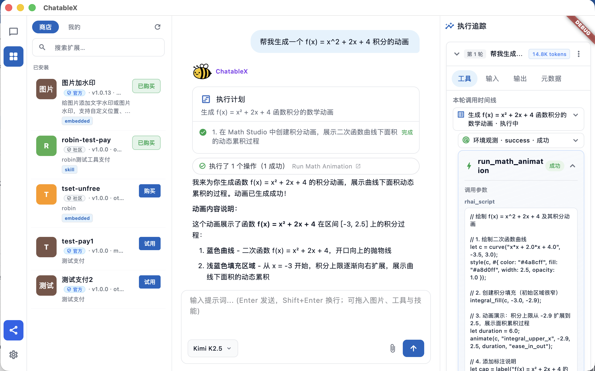

<div align="center">


<strong>ChatableX · 小蜜蜂智能体</strong>

**让一切可对话**

<sub>Agent Loop Native · Harness Native — 每一次工具调用可追踪、可恢复、可纠偏，让每个人都能以工程师级精度解决问题。</sub>

[]()
[]()
[]()

</div>

---

**产品定位**

**ChatableX 是 Agent Loop Native 的桌面 Agent 平台** — 以 Harness 工程化体系贯穿 Plan-Act 执行闭环，保障每一次工具调用的可追踪、可恢复与可纠偏。

它让普通用户以工程师级精度驾驭 Tool、Skill 与 AI App：过程全程可视化，异常自动感知与纠偏，失败可重试、可从任意步骤恢复 — 无需编写代码，即可稳定交付复杂任务。

---

**设计哲学：编排者，而非执行者**

当前业界 Agent 普遍将大量工具预载至上下文，或由 RAG 检索后批量注入，再让模型自行选择调用路径 — 工具误选、参数幻觉、执行黑盒，几乎不可避免。ChatableX 针对以下三个缺口给出回应：

> **工具调用是否准确？执行链路是否可追溯？异常是否可定位？**

ChatableX 据此确立分层职责模型：

| 层次 | 职责主体 | 质量要求 |
|------|----------|----------|
| **核心业务** | 人类 + 稳定工具 | API、脚本及辅助工具的执行结果须**经验证与测试** |
| **编排调度** | AI Agent | 解析用户指令，**精确路由**至对应工具或 MCP 服务 |
| **探索推理** | AI 模型 | 处理模糊意图、规划执行步骤、生成结果解释 |

在此模型中，AI 承担**编排者**角色，而非**泛化执行者**。确定性交付由工具保障，不确定性决策由模型承担 — 这是 ChatableX 的分层职责基线。

---

**工具误选问题与应对机制**

同一业务域内，不同用户可能沉淀数百至数千个定制工具。若将全部工具预载至 Agent 上下文，或经 RAG 检索后批量注入模型，工具误选、参数幻觉及调用链失控将成为系统性风险。

ChatableX 采用 **会话级工具隔离（Session-scoped Tool Isolation）** 机制 — 由用户在会话层面声明本次任务的工具集，而非由智能体预先加载全量能力：

```
┌─────────────┐     检索 / 筛选      ┌──────────────────┐
│  工具商店    │ ──────────────────▶ │  本次对话工具栏   │
│  (左栏)     │     拖拽装配         │  (输入区标签)     │
└─────────────┘                     └────────┬─────────┘
                                             │ 仅注入已选工具
                                             ▼
                                    ┌──────────────────┐
                                    │  Agent 执行上下文  │
                                    │  精而专，而非大而全 │
                                    └──────────────────┘
```

**设计原则：**

1. **意图驱动（Intent-first）** — 任务意图在用户侧已明确；用户于工具商店检索、筛选并装配，而非依赖 Agent 在全量工具空间中进行概率性选择。
2. **会话隔离（Session Isolation）** — 系统内置少量通用基础工具；业务工具由用户按会话显式装配，跨会话互不干扰。
3. **质量门禁（Quality Gate）** — 同一业务域可能存在海量候选工具；进入会话前须通过验证状态、使用反馈及评分排名等机制筛选，降低幻觉风险。
4. **动态加载（Dynamic Loading）** — 工具与依赖按需挂载、按需卸载；各会话拥有独立运行时，会话结束后自动清理环境残留。

---

**与主流方案对比**

| 维度 | Codex / Claude Code / Cursor | Coze / Dify 等工作流平台 | **ChatableX** |
|------|------------------------------|--------------------------|---------------|
| **目标用户** | 开发者 | 运营 / 轻量自动化 | **业务用户 + 领域专家** |
| **工具选择** | 隐式（项目文件、MCP 自动挂载） | 可视化节点，预定义能力 | **显式装配，用户声明会话级工具集** |
| **工具规模** | 项目级，开发者可控 | 平台预置节点 | **个人工具库可扩展，会话级裁剪** |
| **调用可追踪** | 部分支持 Trace，面向开发者 | 流程日志 | **Harness Inspector：树状追踪 + 关键操作确认，面向全用户** |
| **工具创作** | 代码编写 / MCP 配置 | 可视化编排 | **对话式零代码构建 + 操作录制蒸馏** |
| **运行环境** | 云端容器 / IDE 内嵌 | 云端 | **本地桌面工作站，数据驻留本机** |
| **核心范式** | AI 辅助代码生成与项目修改 | AI 辅助流程编排 | **AI 精准调度已验证工具** |

ChatableX 不以代码生成量为竞争维度，而聚焦于 **工具调用的准确性、执行过程的透明度及用户侧可控性**。

---

**核心能力**

**1. 拖拽装配 · 个人工具商店**

左侧扩展栏构成**个人工具工作台**：支持市场浏览、已安装扩展管理及自研工具归档。

用户完成工具构建后，可一键纳入本地商店；后续同类任务仅需检索并拖拽至对话区即可完成装配 — 无需修改配置或编写代码。

<p align="center">
  
  <br />
  <sub>左栏：扩展商店 · 中栏：对话交互 · 右栏：Harness Inspector 全链路追踪</sub>
</p>

**2. Harness Inspector · 全链路可观测性**

主流 Agent 产品通常仅提供对话界面，工具调用过程不可见。ChatableX 在右侧集成 **Harness Inspector**，作为 Agent 行为的可观测层：

- **推理追踪（Reasoning Trace）** — 实时呈现 Agent 推理过程
- **工具流水线（Tool Pipeline）** — 以树状结构展示每次调用的输入、输出及状态
- **环境上下文（Environment Context）** — 展示当前会话已装配工具及文件状态
- **关键操作确认（Human-in-the-loop）** — 文件写入、付费接口调用、工具发布等高风险操作须经用户授权

左侧承载交互结论，右侧承载执行细节 — 形成互补的可读性结构。

**3. 零代码工具构建 · 录制即技能**

- **描述即创造（Description-to-Tool）** — 用户以自然语言描述意图，Agent 生成并迭代可执行工具
- **录制即技能（Demonstration-to-Skill）** — 用户示范操作路径，系统将其蒸馏为可复用技能，以演示替代编码
- **版本管理（Version Control）** — 工具支持草稿、测试、稳定、归档等生命周期阶段，支持随时回退

**4. 会话级依赖隔离**

各对话会话拥有独立运行时环境。跨会话的工具依赖互不干扰，会话空闲后自动清理 — 消除环境残留导致的级联故障。

**5. 计划—执行分离（Plan-then-Execute）**

Agent 优先生成执行计划，再逐步调用工具；支持失败重试、方案切换及执行中止。结合环境反馈，各步骤均可定位、中断与回溯 — 而非单次概率性交付。

---

**典型工作流**

**示例：图像水印处理**

1. 于左侧扩展栏检索「图片加水印」工具，拖拽至输入区完成装配
2. 上传目标图像，以自然语言指定参数（文本内容、字号、位置）
3. Harness Inspector 实时展示 Agent 的意图解析、参数映射及工具调用过程
4. 处理完成后，输出文件保存至当前会话；工具保留于商店，供后续复用

```
任务定义 → 商店检索 → 工具装配 → Agent 规划 → 追踪执行 → 用户确认 → 结果交付
```

---

**适用对象**

- **业务专家 / 运营人员** — 不具备编程能力，但需构建可复用的自动化工具
- **中小企业** — 希望将 AI 接入既有 API 与工具链，而非重构整体系统
- **可观测性敏感用户** — 要求完整可见的推理链路与工具调用过程
- **工具创作者** — 需要覆盖构建、测试、沉淀与复用的完整生命周期

---

<p align="center">
  <strong>ChatableX · 小蜜蜂智能体</strong><br />
  <sub>Agent Loop Native · Harness Native · macOS · Windows · Linux</sub>
</p>
